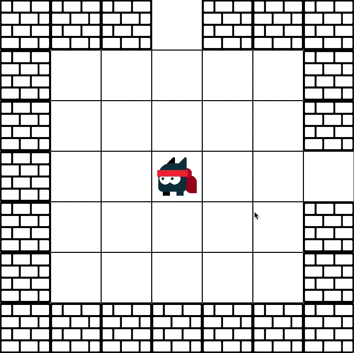

# IPEXAM
## Intro
This is the game i developed for my C++ midterm exam at Uantwerpen. Everything is dynamic including: maps, items, mapsize, ... . Only the screensize and sprite size are fixed but can be easily changed.  

## Contents
- Collision handling
- Attachpower system
- Room system
- Dynamic map loading
## Gameplay
